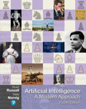

<!-- #region -->
# Artificial Intelligence - Simple Python Code Examples and Assignments




Assignments and examples for the course in CS 5/7320 Artificial Intelligence taught at the 
[Computer Science Department at SMU](https://www.smu.edu/Lyle/Academics/Departments/CS) by [Michael Hahsler](https://michael.hahsler.net/). Slides and more information for students taking the course can be found on 
[SMU's Canvas](https://www.smu.edu/OIT/Services/Canvas).


The code examples follow the textbook [Artificial Intelligence: A Modern Approach](http://aima.cs.berkeley.edu/) by Russell and Norvig. The code in this repository is intended to be simple to focus more on the basic AI concepts and less on the use of advanced implementation techniques (e.g., object-oriented design).
More complex code examples accompanying the textbook can be found at the [GitHub repository aimacode](https://github.com/aimacode).  

## Covered Chapters

| Chapter | Slides | Code |
| :-------| :----: | :--: |
| 1: Introduction to AI | [Slides](https://mhahsler.github.io/CS7320-AI/slides/01_intro.pdf) | - | 
| 2: Intelligent Agents | [Slides](https://mhahsler.github.io/CS7320-AI/slides/02_agents.pdf) | [Code](Agents) | 
| 3: Solving Problems by Search | [Slides](https://mhahsler.github.io/CS7320-AI/slides/03_search.pdf) | [Code](Search) |
| 4.1: Search in Complex Environments: Local Search | [Slides](https://mhahsler.github.io/CS7320-AI/slides/04_local_search.pdf) | [Code](Local_Search) |
| 4: Search in Complex Environments: Search with Uncertainty | [Slides](https://mhahsler.github.io/CS7320-AI/slides/04_search_with_uncertainty.pdf) | [Code](Games) |
| 5: Adversarial Search and Games | [Slides](https://mhahsler.github.io/CS7320-AI/slides/05_games.pdf) | [Code](Games) |
| 6: Constraint Satisfaction Problem | [Slides](https://mhahsler.github.io/CS7320-AI/slides/06_CSP.pdf) | [Code](CSP) |
| 7-9: Logical Agents | [Slides](https://mhahsler.github.io/CS7320-AI/slides/07_logic.pdf) | - |
| 12: Uncertainty | [Slides](https://mhahsler.github.io/CS7320-AI/slides/12_uncertainty.pdf) | [Code](Uncertainty) |
| 13: Probabilistic Reasoning | [Slides](https://mhahsler.github.io/CS7320-AI/slides/13_bayes_nets.pdf) | [Code](Uncertainty) |
| 19: Learning from Examples (Machine Learning) | [Slides](https://mhahsler.github.io/CS7320-AI/slides/19_ML_intro.pdf) | [Code](ML) |

## Installing Python and Jupyter Notebook

You can experiment with the code online without installation using Binder. 
[](https://mybinder.org/v2/gh/mhahsler/CS7320-AI/HEAD)

To work on assignments, you need to install Python and Jupyter Notebook on your system. You can 
* __[preferred solution]__ Install [Docker](https://www.docker.com/products/docker-desktop) and 
execute `docker run -p 8888:8888 -e JUPYTER_ENABLE_LAB=yes jupyter/datascience-notebook` to download and create a container that runs
Jupyter Lab and bookmark the link (including the login token) that you get during installation. 
Details and configuration options can be found on the [Jupyter Docker stack GitHub page](https://github.com/jupyter/docker-stacks)) 
From now on, use `docker ps -a` to list containers and their container id, `docker stop <container id>` and `docker start <container id>` to stop and start the container (**do not use `run` again** because it will create a new empty container).

* Install Python, Jupyter Notebook, and the needed packages (e.g., using [Anaconda](https://www.anaconda.com/)).

## Learning Python and Jupyer Notebook

If you are not familiar with Python, then you should work through one of the many Python tutorials (e.g., [this tutorial](https://www.w3schools.com/python/default.asp)) to learn the basics about Python and the packages `numpy` and `pandas`. Some code examples that help with the assignments are available [here](Python_Code_Examples).

How to use Jupyter notebooks is covered in many online tutorials like the [Jupyer notebook tutorial](https://www.dataquest.io/blog/jupyter-notebook-tutorial/).

## Working on Assignments

You can fork this repository to work on your solutions with version control.
The assignments are improved frequently, so always sync your fork before you start to work on a new assignment. Here is how to update your repository with my changes:

```
git fetch upstream
git checkout master
git merge upstream/master
git push
```

Your assignment notebooks needs to be a complete project reports with 

- documentation (including your design choices), 
- code (with comments for difficult to unserstand sections) and
- results (e.g., tables with simulation results) with a short discussion of what they mean. 

Use the provided notebook cells and insert additional code and markdown cells as needed.

## License
All code and documents in this repository are provided under [Creative Commons Attribution-ShareAlike 4.0 International (CC BY-SA 4.0) License.](https://creativecommons.org/licenses/by-sa/4.0/)


<!-- #endregion -->
